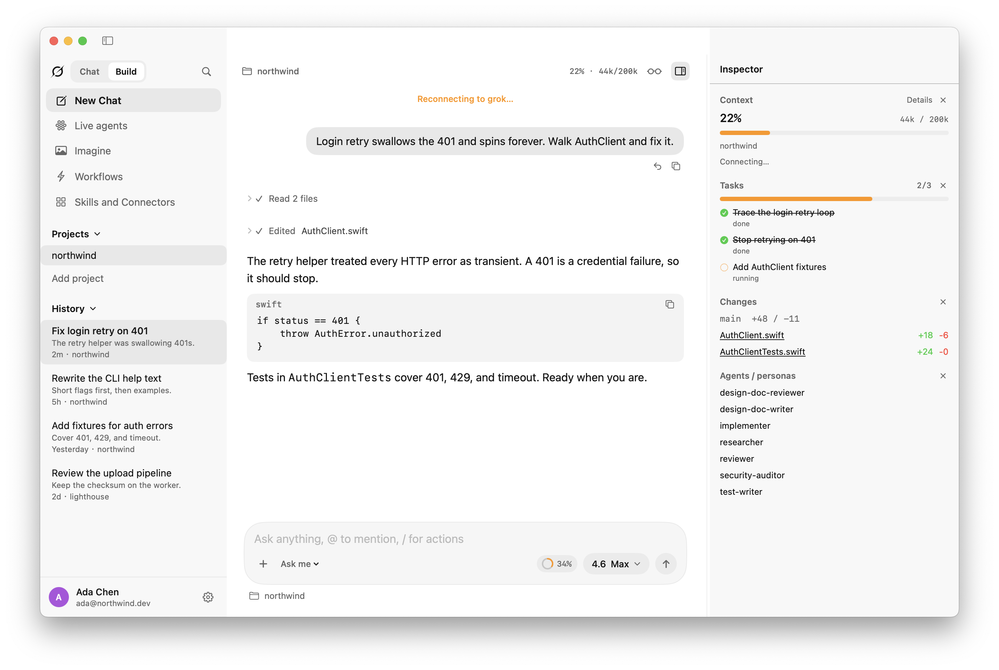

# Grok Desktop

[](https://github.com/wolfqing/GrokDesktop/releases/latest)
[](https://github.com/wolfqing/GrokDesktop)
[](https://www.swift.org)
[](https://developer.apple.com/xcode/swiftui/)
[](https://agentclientprotocol.com)
[](LICENSE)

A native macOS SwiftUI client for [Grok](https://grok.com/) and [Grok Build](https://x.ai/build).

- **Chat** embeds grok.com in the window.
- **Build** talks to your local `grok` CLI over ACP. Sessions, skills, Imagine, and config stay in `~/.grok`.

This entire app was built with [Grok Build](https://x.ai/build) on Grok 4.6.

Community project. Not an official xAI / SpaceXAI product.



## Install

**Download:** [Grok-Desktop-0.1.19.zip](https://github.com/wolfqing/GrokDesktop/releases/download/v0.1.19/Grok-Desktop-0.1.19.zip) · [All releases](https://github.com/wolfqing/GrokDesktop/releases)

1. macOS 14+
2. Unzip and move `Grok Desktop.app` to Applications
3. Official Grok Build CLI
4. A grok.com account (`grok login`) or `XAI_API_KEY`

```bash
curl -fsSL https://x.ai/cli/install.sh | bash
grok login
```

Grok Desktop does **not** ship the `grok` binary. It looks on `PATH`, then `~/.local/bin/grok`, `~/.grok/bin/grok`, `/opt/homebrew/bin/grok`, and `/usr/local/bin/grok`.

The zip is unsigned unless a release says otherwise. First open: right-click the app → Open.

If it won't install, won't open, or you want a feature: [open an issue](https://github.com/wolfqing/GrokDesktop/issues/new/choose).

**Chat** can sign in on grok.com inside the app. **Build** needs the CLI (and `grok login` or an API key). Signing in from the app WebView can cover both when you use a grok.com account.

## Layout

- Sidebar switch: **Chat** | **Build** (`⌘1` / `⌘2`)
- **Chat**: grok.com. History stays on the web, not mixed with Build sessions.
- **Build left**: new session, search, Imagine, live agents, history grouped by project folder from `~/.grok/sessions` (Codex / Claude style). Opening a past chat shows right away; long sessions load in the background. Adding a named project keeps the folders already inferred from sessions.
- **Imagine**: local image and short video through the grok agent (`/imagine`, `/imagine-video`). Recents come from session `images/` folders. This is not grok.com/imagine inside Chat.
- **Build center**: conversation, Markdown, clickable files/links. Scroll away and a down arrow jumps back to the latest message. The latest prompt can be put back in the composer.
- **Build inspector**: context, tasks, plan, diffs, live terminals
- **Settings**: account, appearance, behavior, extensions — reads `~/.grok/config.toml`

## Build from source

Command Line Tools are enough. Xcode.app is not required.

```bash
swift build -c release
./scripts/bundle.sh
open "dist/Grok Desktop.app"
```

```bash
swift run GrokDesktop
swift run GrokDesktopSmoke
```

There is no XCTest target. Smoke lives in `GrokDesktopSmoke`.

Release zip (unsigned unless you have a Developer ID):

```bash
./scripts/release.sh
./scripts/release.sh --publish   # GitHub release
```

To notarize, set `SIGN_IDENTITY` to a Developer ID Application identity and `NOTARY_PROFILE` to a stored notarytool profile, then run `./scripts/release.sh --publish`.

## License

Apache-2.0. See [LICENSE](LICENSE).

Grok, Grok Build, and grok.com are trademarks of their owners.
